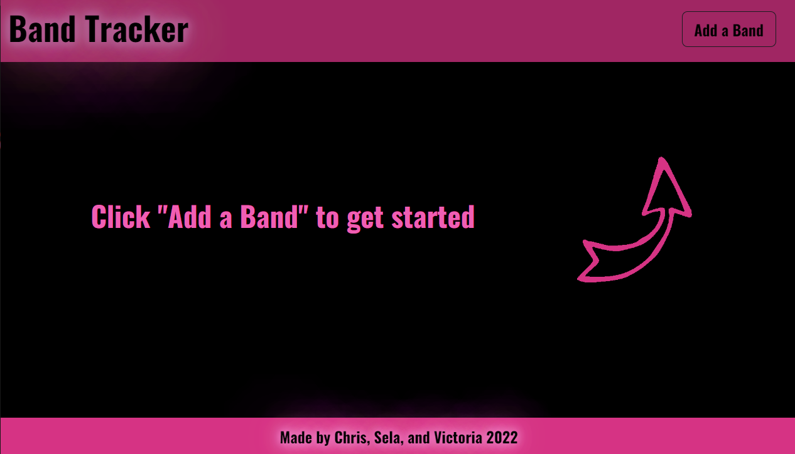

# Band Tracker

## Table of Contents
1. [Description](#description)
2. [Visuals](#visuals)
3. [Collaborators](#collaborators)
4. [Resources](#resources)

## Description
The Band Tracker is a single-page web application that allows the user to enter their favorite bands, and see their upcoming shows.  The page uses the [BandsInTown](https://artists.bandsintown.com/support/public-api?_ga=2.85404761.1920552407.1654713619-1421626117.1654713619) API to retreive artist and event information.  The page also uses the [OpenWeatherMap](https://openweathermap.org/api) API to get the weather for the venue, if the show is within the next 7 days.  

The page directs you to add your first band, in the event you haven't already done so, and bands can be added and removed through the page's interface.  Bands being tracked are persistent using browser localStorage.

Bootstrap 5 is used for the formatting and base styling, while the rest of the styling comes from CSS. [Moment.js](https://momentjs.com/) is used to handle some date/time presentation.

## Visuals
Getting Started

Adding an Artist/Band

Viewing your Artists/Bands

## Collaborators
Chris Okamuro, Sela Privette, Victoria Malie

## Resources

[Live Site](https://cokamuro.github.io/band-tracker/)

[Repository](https://github.com/cokamuro/band-tracker)